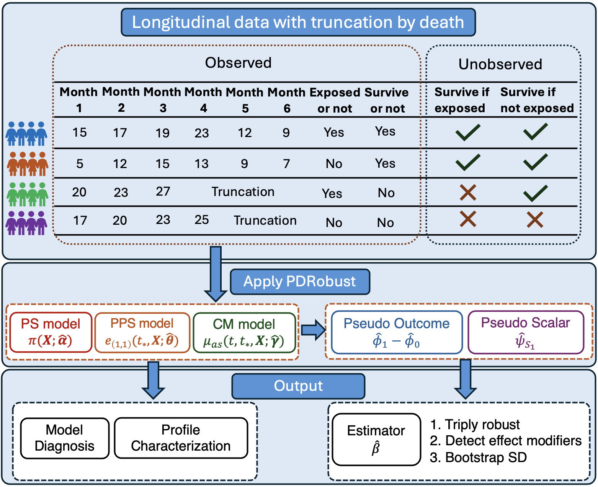

```{r setup, include = FALSE}
knitr::opts_chunk$set(
  collapse = TRUE,
  comment = "#>",
  fig.path = "man/figures/README-",
  dev = "ragg_png",
  dpi = 192,
  fig.width = 7,
  fig.height = 4.5,
  out.width = "90%",
  fig.align = "center",
  warning = FALSE,
  message = FALSE
)
```

# PDRobust: A Novel Analytical Tool for Evaluating Longitudinal Trajectories with truncation by death.



<!-- badges: start -->

[](https://github.com/whhuan/PD_Robust/actions/workflows/R-CMD-check.yaml)

<!-- badges: end -->

## Background

Real-world data, such as administrative claims and/or electronic health records,
is widely used for conducting longitudinal trajectory analyses. However, when
investigating the trajectory of the Heterogeneous Treatment Effect (HTE) of an
exposure/intervention, traditional methods cannot sufficiently address
challenges inherent to the data, including

(i) the presence of truncation by death, and

(ii) the characterization of the unobserved principal stratum of patients who
     would survive till the specific time point regardless of the exposure
     occurrence.

Therefore, methodological innovation is required to deal with these two
challenges to obtain valid inference and interpretability.

## Introduction

**PDRobust** is a novel analytical tool that incorporates multiple statistical
techniques, including propensity score weighting, principal score weighting,
conditional outcome mean fitting, and projection methods. It provides a thorough
set of analyses, including the triply robust estimate of the HTE with the
bootstrap standard deviation, and the diagnosis of nuisance models. The workflow
implemented in `PDRobust` is outlined below, followed by an illustrative example
demonstrating its application.

``` text
data -> Mapping() -> DataCheck() -> DataStandard()
     -> prediction / diagnostic / analysis functions
```

### 1. Load the built-in package data

`ImperfectConSample` is a built-in example with deliberately imperfect records
and continuous outcome for demonstrating validation and explicit subject-level
deletion.

```{r}
library(PDRobust)
data("ImperfectConSample", package = "PDRobust")
dim(ImperfectConSample)
```

```{r}
head(ImperfectConSample)
```

### 2. Define roles and analysis settings with `Mapping()`

`Mapping()` is the sole source of truth for structural column names, raw
baseline and cutoff times, all nuisance-model covariates, effect modifiers, and
the outcome type.

```{r}
mapping <- Mapping(
  id = "patient_id",
  time = "visit_month",
  treatment = "treatment",
  survival = "alive_status",
  outcome = "clinical_outcome",
  baseline_time = 0,
  cutoff_time = 12,
  covariates = c("X1", "X2", "X3", "X4", "X5", "X6"),
  interest_vars = c("X1", "X2"),
  y_type = "C"
)
```

### 3. Validate the raw data with `DataCheck()`

`DataCheck()` never modifies the input data. It returns an itemized validation
report that includes the pass/fail status, severity, analysis-blocking status,
diagnostic details, and recommended handling for each identified issue. Besides,
it also returns dataset-level indicators: whether the dataset is ready for
analysis, whether it can be processed by `DataStandard()` and whether it
requires manual resolution.

```{r}
check <- DataCheck(ImperfectConSample, mapping)
```

```{r}
names(check)
```

```{r}
check$ready_for_analysis
check$manual_resolution_required
check$can_standardize
```

### 4. Standardize the panel with `DataStandard()`

`DataStandard()` returns a sorted data frame. It safely converts explicit binary
encodings, maps subject identifiers and analysis-time to consecutive integers,
and attaches mapping and audit attributes. The argument `drop` is defaulted by
`False` and use `drop = TRUE` only when the reported subject-level exclusions
are intended.

```{r}
pd_data <- DataStandard(ImperfectConSample, mapping, drop = TRUE)
```

```{r}
head(pd_data)
```

### 4. Run analysis and diagnostic functions

Before conducting analyses, nuisance model specification is
required.Here,`ps_fo` denotes the propensity score model,`prin_fo` denotes
principal score model, and `out_fo` denotes outcome model.

```{r}
ps_fo <- treatment ~ X1 + X2 + X3 + X4 + X5 + X6
prin_fo <- alive_status ~ X1 + X2 + X3 + X4 + X5 + X6 
out_fo <- clinical_outcome ~ (X1 + X2 + X3 + X4 + X5 + X6) * treatment 
```

`HTESepT()`estimates the time-varying heterogeneous treatment effect. For each
time point specified in `target_time`, it primarily returns the estimated
intercept and effects asscociated with the covariates of interest, together wth
correspinding forest plots.

The argument `target_time` controls only the outcome-analysis time points
reported in the results. Setting `B > 0` enables subject-level bootstrap
estimation of standard errors and confidence intervals. When `B = 0`, the
function will only return the point estimates.

```{r}
separate_hte <- HTESepT(
  pd_data,
  ps_fo = ps_fo,
  prin_fo = prin_fo,
  out_fo = out_fo,
  target_time = c(1, 2),
  B = 3,
  verbose = TRUE
)
```

```{r}
separate_hte$summary
```

```{r}
separate_hte$forest_plot
```

The following table summarizes the objectives and arguments of all functions
provided by the package.

| Function and arguments | Objectives and returned results |
|:-------------------------------|:-----------------------------------------------|
| `Mapping(id, time, treatment, survival, outcome, baseline_time, cutoff_time, covariates, interest_vars, y_type)` | Defines the structural roles of variables, analysis times, covariates, effect modifiers, and outcome type. |
| `DataCheck(data, mapping, strict = FALSE)` | Evaluates data readiness and returns dataset-level validation flags, itemized checks, diagnostic details, and recommended handling. |
| `DataStandard(data, mapping, drop = FALSE)` | Returns a standardized and sorted longitudinal data frame with attached mapping and audit attributes. |
| `PSPred(ps_fo, fit_dat, pred_dat, mapping, ...)` | Returns row-aligned propensity score predictions. |
| `PrinPred(prin_fo, fit_dat, pred_dat, a, mapping, ...)` | Returns row-aligned cumulative principal score predictions under treatment level `a`. |
| `OutPred(out_fo, fit_dat, pred_dat, a, mapping, ...)` | Returns row-aligned potential-outcome predictions under treatment level `a`. |
| `PSDiag(data, ps_fo)` | Computes standardized mean differences for covariate-balance assessment of the fitted propensity score model; Returns the numeric results and corresponding diagnostic plot. |
| `PrinSDiag(data, ps_fo, prin_fo)` | Computes standardized test statistics for covariate-level assessment of the fitted principal score model; Returns the numeric results the corresponding diagnostic plot. |
| `SA(data, ps_fo, prin_fo, out_fo, ratiovec = c(0, 0.05, 0.10))` | Evaluates the sensitivity of the fitted outcome model to varying levels of unexplained variance or model misspecification; Returns the corresponding estimates and plots. |
| `QR(data, prin_fo, quantile_level = 0.5)` | Returns principal-stratum profiles, including means and a user-specified quantile for selected patient characteristics, together with a plot. |
| `ORCI(data, formula, a, conf_level = 0.95)` | Returns estimated odds ratios and confidence intervals for covariates associated with principal-stratum membership under treatment level `a`, and the corresponding plot. |
| `HTESepT(data, ps_fo, prin_fo, out_fo, target_time, B, conf_level = 0.95, max_attempts = NULL, verbose = TRUE)` | Returns time-specific heterogeneous treatment effect estimates, bootstrap results, and forest plots for the specified analysis times. |
| `HTEAllT(data, ps_fo, prin_fo, out_fo, B, conf_level = 0.95, max_attempts = NULL, verbose = TRUE)` | Returns pooled heterogeneous treatment effect estimates across analysis times, bootstrap results, and a forest plot. |

**More tutorials available on
[tutorials](https://whhuan.github.io/PD_Robust/).**

## Installation

```{r}
# if (!require("devtools")) {
#   install.packages("devtools")
# }
# devtools::install_github("whhuan/PD_Robust")
```
