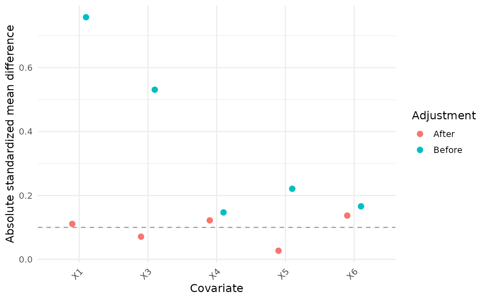
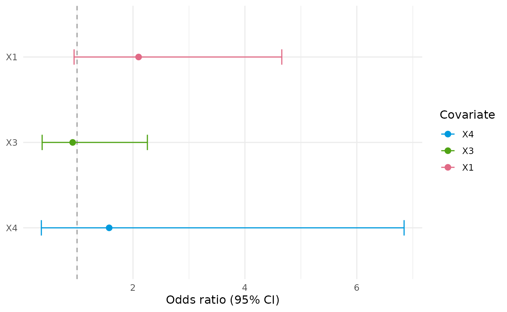
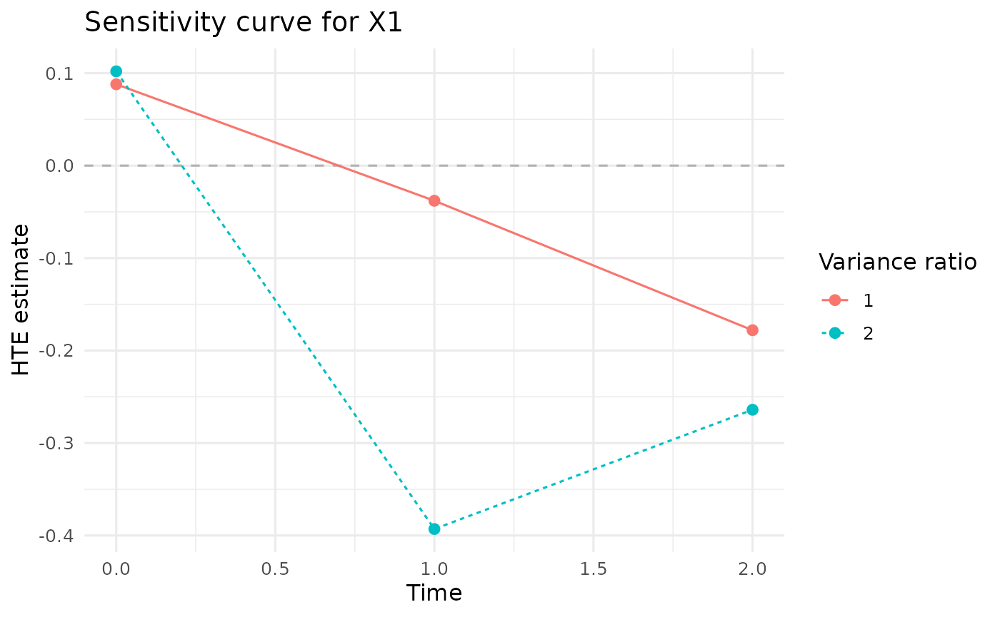
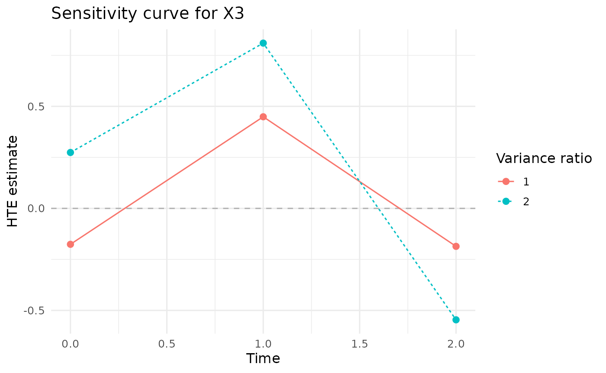
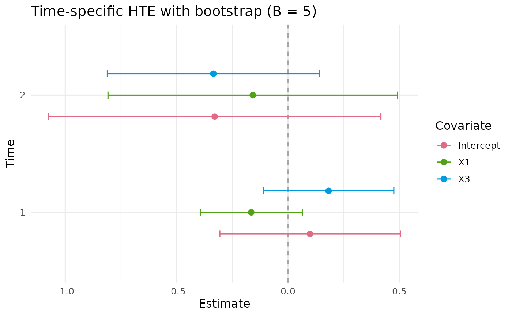
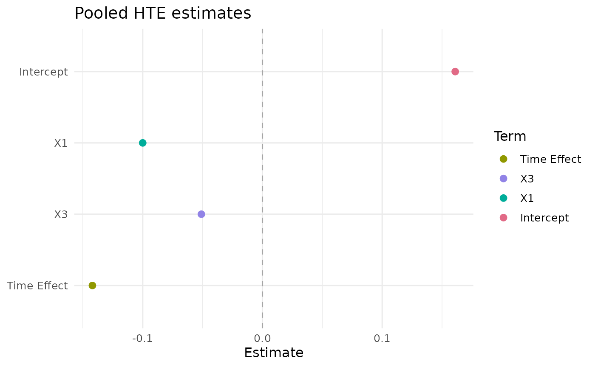

# Detailed Function Presentation

## PDRobust

PDRobust implements principal-stratification analyses for longitudinal
outcomes that may be truncated by death. Version 0.3.7 uses an explicit
mapping-driven workflow and refits each nuisance prediction model from
the data supplied to the current function call.

``` text
data("BiSample") -> Mapping() -> DataCheck() -> DataStandard() -> prediction / diagnostic / analysis functions
```

### 1. Load the built-in package data

``` r

library(PDRobust)
data("BiSample", package = "PDRobust")
head(BiSample)
```

    ##   id time S A Y     X1     X2     X3 X4 X5 X6
    ## 1  1    0 1 1 0  1.521  0.261  0.649  0  1  0
    ## 2  1    1 1 1 0  1.521  0.261  0.649  0  1  0
    ## 3  1    2 1 1 1  1.521  0.261  0.649  0  1  0
    ## 4  2    0 1 1 0 -0.395 -1.241 -0.115  0  1  0
    ## 5  2    1 1 1 0 -0.395 -1.241 -0.115  0  1  0
    ## 6  2    2 1 1 0 -0.395 -1.241 -0.115  0  1  0

``` r

data("ImperfectConSample", package = "PDRobust")
head(ImperfectConSample)
```

    ##   patient_id visit_month alive_status treatment clinical_outcome     X1     X2
    ## 1    PT-0171           0            1         1            4.598  1.452 -2.075
    ## 2    PT-0100           6            0         1               NA  1.473 -0.758
    ## 3    PT-0056           0            1         0            8.806 -2.722 -0.735
    ## 4    PT-0034           6            1         0           13.851 -1.471  0.278
    ## 5    PT-0164          12            1         1            9.643 -1.272 -1.881
    ## 6    PT-0058           0            1         1           10.341 -0.534 -0.842
    ##       X3 X4 X5 X6
    ## 1 -0.147  0  1  1
    ## 2  0.608  0  1  1
    ## 3  0.424  1  1  0
    ## 4 -0.158  0  0  0
    ## 5 -3.333  0  1  0
    ## 6 -0.092  0  1  0

this dataset has unordered patient id, visit month是记录的时间节点；X1 –
X6是一些基础数据，是covariates；alive status记录了此刻是否存活，

Both objects are ordinary long-format data frames loaded from the
package `data/` directory. `BiSample` is the analysis-ready binary
example used for the main workflow. `ImperfectConSample` is a continuous
example with deliberately imperfect records for demonstrating validation
and explicit subject-level deletion.

### 2. Define roles and analysis settings with `Mapping()`

``` r

mapping <- Mapping(
  id = "id",
  time = "time",
  treatment = "A",
  survival = "S",
  outcome = "Y",
  baseline_time = 0,
  cutoff_time = 2,
  covariates = c("X1", "X3", "X4", "X5", "X6"),
  interest_vars = c("X1", "X3"),
  y_type = "B"
)

mapping
```

    ## PDRobust data mapping
    ##   ID: id
    ##   Time: time
    ##   Treatment: A
    ##   Survival: S
    ##   Outcome: Y
    ##   Baseline time: 0
    ##   Cutoff time: 2
    ##   Mapped covariates: X1, X3, X4, X5, X6
    ##   Interest variables: X1, X3
    ##   Outcome type: B (binary)

[`Mapping()`](https://whhuan.github.io/PD_Robust/reference/Mapping.md)
returns a `pd_mapping` object containing the structural column names,
raw baseline and cutoff times, all nuisance-model covariates, effect
modifiers, and the outcome type.

### 3. Validate the raw data with `DataCheck()`

``` r

check <- DataCheck(BiSample, mapping, strict = FALSE)
names(check)                   
```

    ## [1] "valid"                      "ready_for_analysis"        
    ## [3] "manual_resolution_required" "can_standardize"           
    ## [5] "checks"                     "settings"                  
    ## [7] "diagnostics"

``` r

check$ready_for_analysis
```

    ## [1] TRUE

``` r

check$manual_resolution_required
```

    ## [1] FALSE

``` r

head(check$checks)                   # one row per validation rule
```

    ##                    check passed severity standardize_can_fix
    ## 1       required_columns   TRUE    error               FALSE
    ## 2          nonempty_data   TRUE    error               FALSE
    ## 3     missing_id_or_time   TRUE    error               FALSE
    ## 4          time_encoding   TRUE  warning               FALSE
    ## 5 mapping_time_endpoints   TRUE    error               FALSE
    ## 6     analysis_time_grid   TRUE    error               FALSE
    ##   requires_manual_resolution analysis_blocking
    ## 1                      FALSE              TRUE
    ## 2                      FALSE              TRUE
    ## 3                      FALSE              TRUE
    ## 4                      FALSE             FALSE
    ## 5                      FALSE              TRUE
    ## 6                      FALSE              TRUE
    ##                                                                          details
    ## 1                                               10 required columns are present.
    ## 2                                                             600 rows detected.
    ## 3                                               No rows have missing ID or time.
    ## 4                       Time class: integer ; values can be ordered numerically.
    ## 5               baseline_time = 0 ; cutoff_time = 2 ; observed times = 0, 1, 2 .
    ## 6 All actual observed times from baseline through cutoff are included: 0, 1, 2 .
    ##                                                                                                        recommendation
    ## 1                                                     Correct the mapping or add/rename the missing columns manually.
    ## 2                                                                             Supply a nonempty long-format data set.
    ## 3                            Restore the identifiers/time values, or use `drop = TRUE` to remove unidentifiable rows.
    ## 4                                      Standardization will map required raw times to internal integers 0, 1, ..., n.
    ## 5                                                  Correct the mapping or the underlying time coding before analysis.
    ## 6 Correct the mapped endpoints or underlying time records. All observed visits within the mapped window are retained.

``` r

head(check$diagnostics)               # affected rows, IDs, and time summaries
```

    ## $missing_id_time_rows
    ## integer(0)
    ## 
    ## $duplicate_rows
    ## integer(0)
    ## 
    ## $duplicate_subjects
    ## character(0)
    ## 
    ## $missing_by_time
    ##   time missing_subjects
    ## 1    0                0
    ## 2    1                0
    ## 3    2                0
    ## 
    ## $incomplete_subjects
    ## character(0)
    ## 
    ## $treatment_invalid_rows
    ## integer(0)

[`DataCheck()`](https://whhuan.github.io/PD_Robust/reference/DataCheck.md)
never modifies the input data. It returns an itemized validation report
with pass/fail status, severity, analysis-blocking status, diagnostic
details, and recommended handling.

### 4. Standardize the panel with `DataStandard()`

[`DataStandard()`](https://whhuan.github.io/PD_Robust/reference/DataStandard.md)
returns a sorted `pd_data` data frame. It safely converts explicit
binary encodings, maps IDs to consecutive integers, maps the observed
analysis-time grid to consecutive integers, and attaches mapping and
audit attributes. Use `drop = TRUE` only when the reported subject-level
exclusions are intended.

``` r

pd_data <- DataStandard(BiSample, mapping,drop =TRUE)
head(pd_data)
```

    ##   id time S A Y     X1     X2     X3 X4 X5 X6
    ## 1  1    0 1 1 0  1.521  0.261  0.649  0  1  0
    ## 2  1    1 1 1 0  1.521  0.261  0.649  0  1  0
    ## 3  1    2 1 1 1  1.521  0.261  0.649  0  1  0
    ## 4  2    0 1 1 0 -0.395 -1.241 -0.115  0  1  0
    ## 5  2    1 1 1 0 -0.395 -1.241 -0.115  0  1  0
    ## 6  2    2 1 1 0 -0.395 -1.241 -0.115  0  1  0

for imperfect dataset, we have:

``` r

data("ImperfectConSample", package = "PDRobust")
head(ImperfectConSample)
```

    ##   patient_id visit_month alive_status treatment clinical_outcome     X1     X2
    ## 1    PT-0171           0            1         1            4.598  1.452 -2.075
    ## 2    PT-0100           6            0         1               NA  1.473 -0.758
    ## 3    PT-0056           0            1         0            8.806 -2.722 -0.735
    ## 4    PT-0034           6            1         0           13.851 -1.471  0.278
    ## 5    PT-0164          12            1         1            9.643 -1.272 -1.881
    ## 6    PT-0058           0            1         1           10.341 -0.534 -0.842
    ##       X3 X4 X5 X6
    ## 1 -0.147  0  1  1
    ## 2  0.608  0  1  1
    ## 3  0.424  1  1  0
    ## 4 -0.158  0  0  0
    ## 5 -3.333  0  1  0
    ## 6 -0.092  0  1  0

``` r

con_mapping <- Mapping(
  id = "patient_id",
  time = "visit_month",
  treatment = "treatment",
  survival = "alive_status",
  outcome = "clinical_outcome",
  baseline_time = 0,
  cutoff_time = 12,
  covariates = c("X1", "X2", "X3", "X4", "X5", "X6"),
  interest_vars = c("X1", "X2"),
  y_type = "C"
)

con_data <- DataStandard(ImperfectConSample, con_mapping, drop = TRUE)
```

``` r

head(con_data)
```

    ##   patient_id visit_month alive_status treatment clinical_outcome     X1     X2
    ## 1          1           0            1         1           10.803  0.168  0.421
    ## 2          1           1            1         1           12.006  0.168  0.421
    ## 3          1           2            1         1            7.833  0.168  0.421
    ## 4          2           0            1         0            4.101 -2.400 -0.324
    ## 5          2           1            1         0            5.508 -2.400 -0.324
    ## 6          2           2            0         0               NA -2.400 -0.324
    ##       X3 X4 X5 X6
    ## 1 -0.557  1  1  1
    ## 2 -0.557  1  1  1
    ## 3 -0.557  1  1  1
    ## 4 -0.391  0  0  0
    ## 5 -0.391  0  0  0
    ## 6 -0.391  0  0  0

``` r

print(dim(ImperfectConSample))
```

    ## [1] 599  11

``` r

print(dim(con_data))
```

    ## [1] 588  11

### Model formulas used below

``` r

ps_fo <- A ~ X1 + X3 + X4 + X5 + X6
prin_fo <- S ~ (X1 + X3 + X4 + X5 + X6 ) * A
out_fo <- Y ~ (X1 + X3 + X4 + X5 + X6) * A + S
```

### 5. Prediction functions

#### `PSPred()`

``` r

ps <- PSPred(
  ps_fo,
  fit_dat = pd_data,
  pred_dat = pd_data,
  mapping = mapping
)

length(ps)              # nrow(pd_data)
```

    ## [1] 600

``` r

head(ps)
```

    ## [1] 0.973 0.973 0.973 0.845 0.845 0.845

[`PSPred()`](https://whhuan.github.io/PD_Robust/reference/PSPred.md)
fits a baseline logistic treatment model and returns one propensity
prediction for every row of `pred_dat`.

#### `PrinPred()`

``` r

p0 <- PrinPred(
  prin_fo,
  fit_dat = pd_data,
  pred_dat = pd_data,
  treatment = 0,
  mapping = mapping
)
head(p0)
```

    ## [1] 1.000 0.936 0.877 1.000 0.831 0.690

[`PrinPred()`](https://whhuan.github.io/PD_Robust/reference/PrinPred.md)
returns cumulative principal-survival probabilities under the requested
treatment. In longitudinal data it fits on post-baseline rows whose
subjects survived the immediately preceding observed time. In a
single-time analysis it uses all complete rows and does not construct an
at-risk indicator.

#### `OutPred()`

``` r

mu1 <- OutPred(
  out_fo,
  fit_dat = pd_data,
  pred_dat = pd_data,
  a = 1,
  mapping = mapping
)

head(mu1)
```

    ## [1] 0.176 0.176 0.176 0.139 0.139 0.139

[`OutPred()`](https://whhuan.github.io/PD_Robust/reference/OutPred.md)
returns predicted outcomes after setting treatment to `a` and survival
to one in `pred_dat`. It uses linear regression for `y_type = "C"` and
logistic regression for `y_type = "B"`.

### 6. Diagnostics

#### `PSDiag()`

``` r

ps_diagnostic <- PSDiag(pd_data, ps_fo)
```

``` r

names(ps_diagnostic)
```

    ##  [1] "smd_before"  "smd_after"   "weights"     "weight_type" "propensity" 
    ##  [6] "data"        "plot"        "formula"     "mapping"     "call"

``` r

print(ps_diagnostic)
```

    ## Exposure-model balance diagnostics
    ##  covariate adjustment   smd
    ##         X1     Before 0.758
    ##         X3     Before 0.531
    ##         X4     Before 0.147
    ##         X5     Before 0.221
    ##         X6     Before 0.166
    ##         X1      After 0.111
    ##         X3      After 0.071
    ##         X4      After 0.122
    ##         X5      After 0.027
    ##         X6      After 0.137

``` r

ps_diagnostic$plot
```



[`PSDiag()`](https://whhuan.github.io/PD_Robust/reference/PSDiag.md)
returns unadjusted and IPTW-adjusted standardized mean differences,
ordinary IPTW weights, clipped propensity scores, plotting data, and a
ggplot. The propensity scores are always truncated internally by
`pmin(pmax(pi, 0.01), 0.99)` before weights are calculated.

#### `PrinSDiag()`

``` r

principal_diagnostic <- PrinSDiag(pd_data, ps_fo, prin_fo)

print(principal_diagnostic)
```

    ## Principal-score diagnostics
    ##  covariate statistic
    ##         X1     0.437
    ##         X3     0.129
    ##         X4    -0.362
    ##         X5    -0.247
    ##         X6     0.160

``` r

principal_diagnostic$plot
```


[`PrinSDiag()`](https://whhuan.github.io/PD_Robust/reference/PrinSDiag.md)
returns cutoff-aligned standardized balance statistics, clipped
propensity scores, cumulative principal scores under treatment 0 and 1,
plotting data, and a ggplot.

### 7. Principal-stratum profiling with `QR()`

[`QR()`](https://whhuan.github.io/PD_Robust/reference/QR.md) returns
principal-score-weighted means and weighted quantiles of the mapped
interest variables at cutoff, together with the weights and mapping.

``` r

principal_profile <- QR(
  pd_data,
  prin_fo,
  quantile_level = c(0.25, 0.50, 0.75)
)

print(principal_profile)
```

    ## Principal-stratum weighted means
    ##     X1     X3 
    ##  0.301 -0.075 
    ## 
    ## Weighted quantiles (NA for binary variables)
    ## $X1
    ##  q0.25  q0.50  q0.75 
    ## -0.303  0.254  0.905 
    ## 
    ## $X3
    ##  q0.25  q0.50  q0.75 
    ## -0.815 -0.123  0.586

### 8. Treatment-group odds ratios with `ORCI()`

``` r

or_control <- ORCI(
  pd_data,
  S ~ X1 + X3 + X4,
  a = 0,
  conf_level = 0.95
)

print(or_control)             
```

    ## Odds ratios and confidence intervals
    ##  covname estcoef lowerbd upperbd
    ##       X1   2.100   0.947   4.659
    ##       X3   0.922   0.376   2.257
    ##       X4   1.574   0.362   6.845

``` r

or_control$plot
```



[`ORCI()`](https://whhuan.github.io/PD_Robust/reference/ORCI.md) returns
treatment-group-specific cutoff odds ratios and confidence intervals,
the fitted logistic model, analysis data, settings, and a forest plot.

### Sensitivity analysis

``` r

sensitivity <- SA(
  pd_data,
  ps_fo,
  prin_fo,
  out_fo,
  ratiovec = c(1, 2)
)
```

    ## Warning: SA() encountered nuisance-model instability in 1 distinct model
    ## warning. Finite prediction-based fits were retained where permitted. Model
    ## fitting warning for `OutPred binary-outcome model`: the logistic model shows
    ## complete or quasi-complete separation; finite predictions are retained, but
    ## coefficient-based interpretation may be unstable.

``` r

print(sensitivity)
```

    ## Sensitivity analysis
    ##  ratiovec time Intercept     X1     X3
    ##         1    0     0.154  0.088 -0.176
    ##         2    0     0.324  0.102  0.274
    ##         1    1    -0.078 -0.038  0.449
    ##         2    1     1.117 -0.393  0.810
    ##         1    2    -0.270 -0.178 -0.186
    ##         2    2     0.044 -0.264 -0.546
    ##   Scenarios: 2

``` r

sensitivity$plot
```

    ## $X1



    ## 
    ## $X3



### 9. Time-specific HTEs with `HTESepT()`

``` r

separate_hte <- HTESepT(
  pd_data,
  ps_fo = ps_fo,
  prin_fo = prin_fo,
  out_fo = out_fo,
  target_time = c(1, 2),
  B = 5,
  conf_level = 0.95,
  max_attempts = NULL,
  verbose = TRUE
)
```

    ## Warning: HTESepT() encountered nuisance-model instability in 1 distinct model
    ## warning. Finite prediction-based fits were retained where permitted. Model
    ## fitting warning for `OutPred binary-outcome model`: the logistic model shows
    ## complete or quasi-complete separation; finite predictions are retained, but
    ## coefficient-based interpretation may be unstable.

    ## Bootstrap: 1/5 successful after 1 attempts.

    ## Bootstrap: 2/5 successful after 2 attempts.

    ## Bootstrap: 3/5 successful after 3 attempts.

    ## Bootstrap: 4/5 successful after 4 attempts.

    ## Bootstrap: 5/5 successful after 5 attempts.

``` r

separate_hte$summary
```

    ##   time covariate estimate    SD LowerBound UpperBound
    ## 1    1 Intercept    0.099 0.207     -0.306      0.504
    ## 2    1        X1   -0.165 0.117     -0.394      0.064
    ## 3    1        X3    0.182 0.149     -0.111      0.475
    ## 4    2 Intercept   -0.329 0.381     -1.075      0.417
    ## 5    2        X1   -0.158 0.331     -0.808      0.491
    ## 6    2        X3   -0.335 0.243     -0.811      0.141

``` r

separate_hte$forest_plot
```



``` r

head(separate_hte$boot_mat)
```

    ##        1_Intercept        1_X1        1_X3 2_Intercept        2_X1       2_X3
    ## boot1 -0.239502284 -0.16918743 -0.03419992  -0.7679871  0.60398101 -0.6951968
    ## boot2  0.297857667 -0.26516751  0.27038474   0.1359330 -0.01942559 -0.1461297
    ## boot3 -0.005750345  0.04934144  0.15954443  -0.6483584 -0.10432988 -0.6986111
    ## boot4  0.199079892 -0.18688483 -0.01701149  -0.6677521 -0.25887365 -0.4621126
    ## boot5  0.032666711 -0.12884115  0.27212344  -0.2286360 -0.04681124 -0.3016708

[`HTESepT()`](https://whhuan.github.io/PD_Robust/reference/HTESepT.md)
returns an HTE estimate for each requested observed standardized time
and each mapped effect modifier, plus the intercept. `target_time`
controls reported outcome-analysis times only; principal scores still
accumulate over the full baseline-to-cutoff grid. Set `B > 0` for
subject-level bootstrap standard errors and Wald confidence intervals.

### 10. Pooled HTEs with `HTEAllT()`

``` r

pooled_hte <- HTEAllT(
  pd_data,
  ps_fo = ps_fo,
  prin_fo = prin_fo,
  out_fo = out_fo,
  B = 0,
  verbose = FALSE
)
```

``` r

pooled_hte$summary
```

    ##          term estimate SD LowerBound UpperBound
    ## 1   Intercept    0.161 NA         NA         NA
    ## 2          X1   -0.100 NA         NA         NA
    ## 3          X3   -0.051 NA         NA         NA
    ## 4 Time Effect   -0.142 NA         NA         NA

``` r

pooled_hte$forest_plot
```



[`HTEAllT()`](https://whhuan.github.io/PD_Robust/reference/HTEAllT.md)
always pools every observed standardized time from baseline through
cutoff. For a single analysis time it omits the time-effect term and
records that the time effect is not estimable.

### 11.

[`SA()`](https://whhuan.github.io/PD_Robust/reference/SA.md) derives the
outcome type from the standardized mapping. Continuous outcomes use the
original linear-model and closed-form sensitivity equations. Binary
outcomes use logistic outcome prediction and the same bounded-link HTE
equation as
[`HTESepT()`](https://whhuan.github.io/PD_Robust/reference/HTESepT.md).
In both cases it returns estimates under each specified outcome-noise
variance ratio, observed outcome variance by time, and one plot per
mapped interest variable.

The continuous built-in example can be prepared explicitly as follows:

``` r

continuous_mapping <- Mapping(
  id = "patient_id",
  time = "visit_month",
  treatment = "treatment",
  survival = "alive_status",
  outcome = "clinical_outcome",
  baseline_time = 0,
  cutoff_time = 12,
  covariates = paste0("X", 1:6),
  interest_vars = c("X1", "X2"),
  y_type = "C"
)
continuous_data <- DataStandard(
  ImperfectConSample, continuous_mapping, drop = TRUE
)
continuous_sensitivity <- SA(
  continuous_data,
  treatment ~ X1 + X2 + X4,
  alive_status ~ X1 + X2 + X4 + treatment + visit_month,
  clinical_outcome ~ X1 + X2 + treatment,
  ratiovec = c(0, 0.05)
)
```
