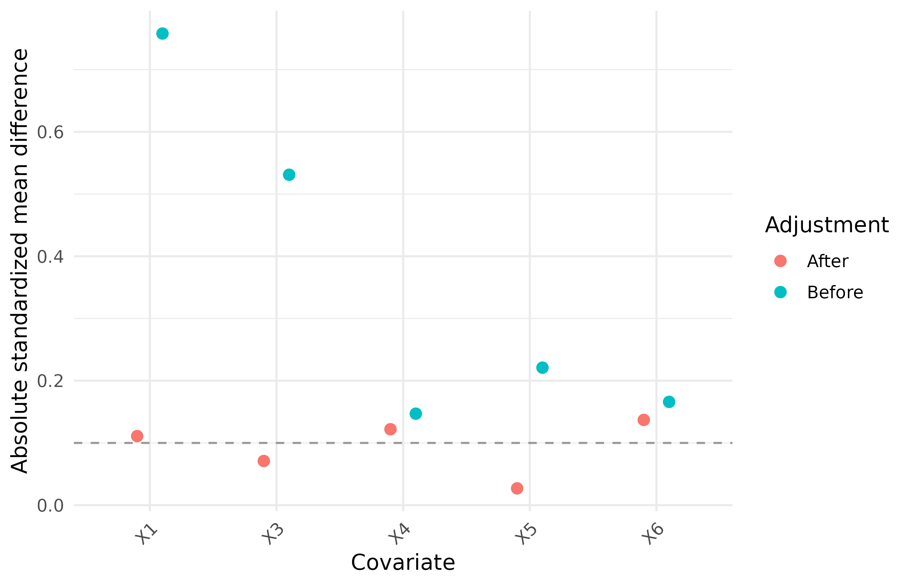
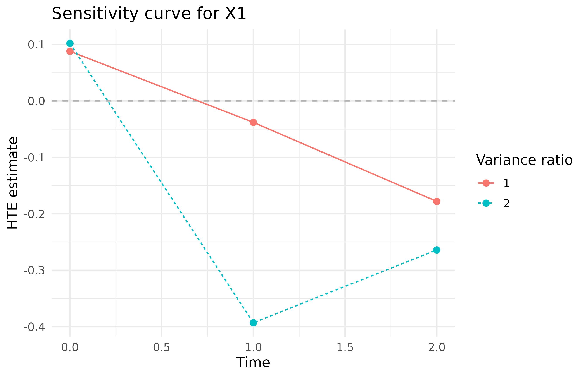
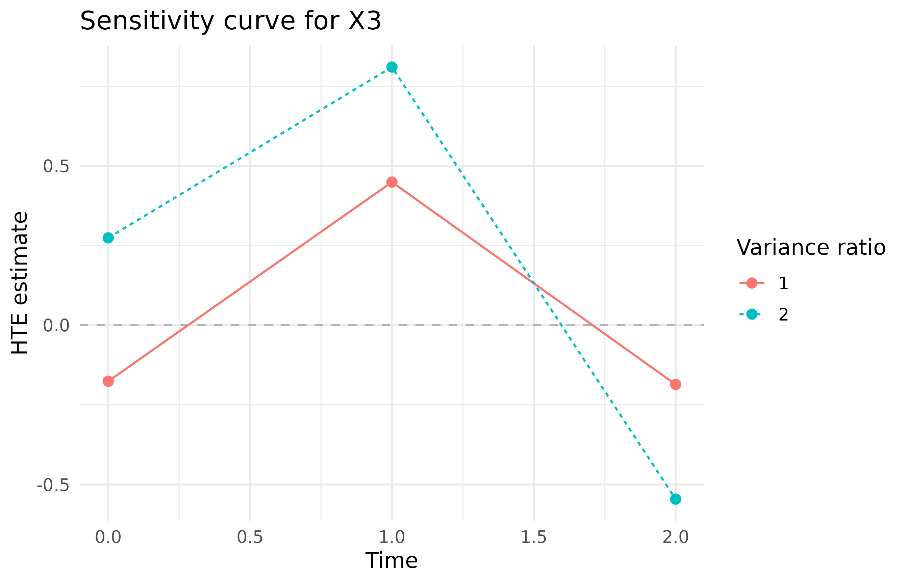
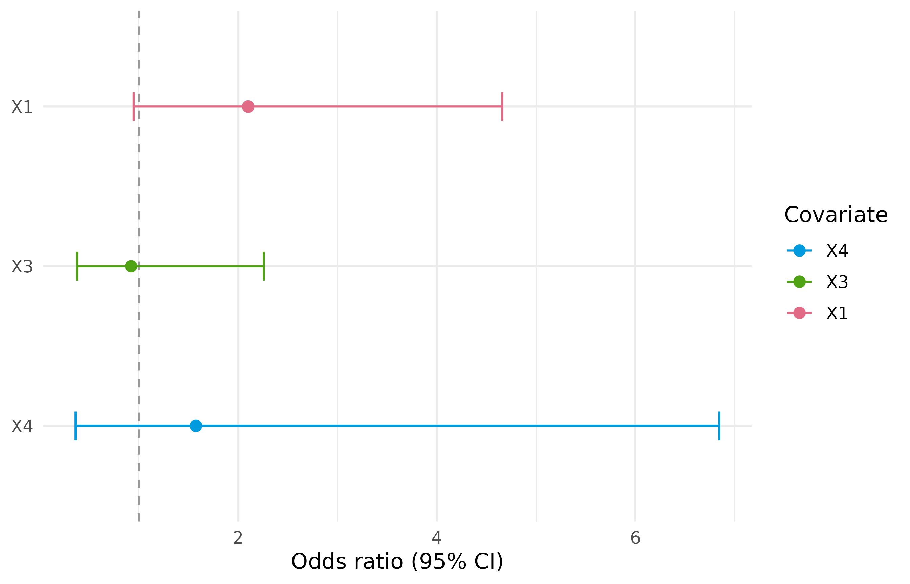
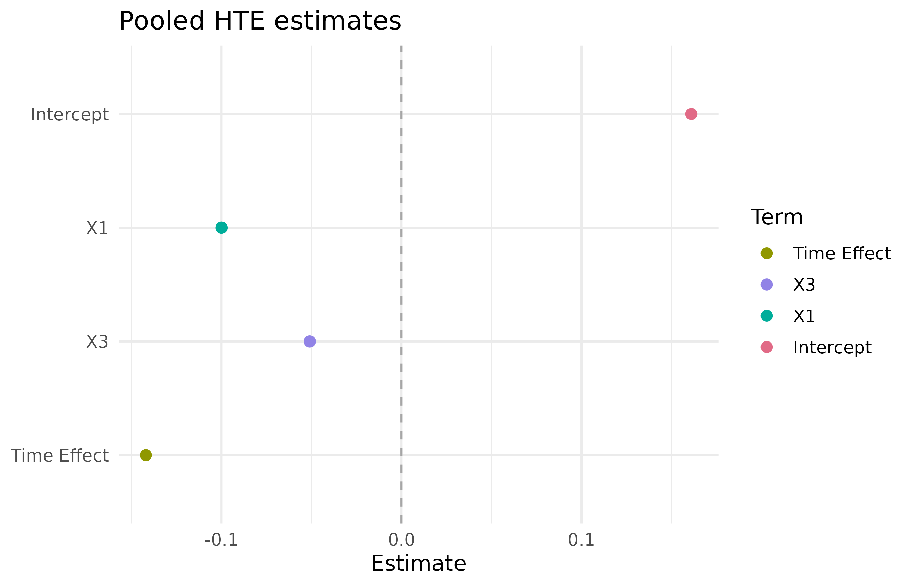

# Detailed Function Presentation

## PDRobust

This is a replicating process for script.

``` text
data("BiSample") -> Mapping() -> DataCheck() -> DataStandard() -> prediction / diagnostic / analysis functions
```

### 1. Load the built-in package data

``` r

library(PDRobust)
data("BiSample", package = "PDRobust")
head(BiSample)
#>   id time S A Y     X1     X2     X3 X4 X5 X6
#> 1  1    0 1 1 0  1.521  0.261  0.649  0  1  0
#> 2  1    1 1 1 0  1.521  0.261  0.649  0  1  0
#> 3  1    2 1 1 1  1.521  0.261  0.649  0  1  0
#> 4  2    0 1 1 0 -0.395 -1.241 -0.115  0  1  0
#> 5  2    1 1 1 0 -0.395 -1.241 -0.115  0  1  0
#> 6  2    2 1 1 0 -0.395 -1.241 -0.115  0  1  0
```

### 2. Define roles and analysis settings with `Mapping()`

``` r

mapping <- Mapping(
  id = "id",
  time = "time",
  treatment = "A",
  survival = "S",
  outcome = "Y",
  baseline_time = 0,
  cutoff_time = 2,
  covariates = c("X1", "X3", "X4", "X5", "X6"),
  interest_vars = c("X1", "X3"),
  y_type = "B"
)

print(mapping)
#> PDRobust data mapping
#>   ID: id
#>   Time: time
#>   Treatment: A
#>   Survival: S
#>   Outcome: Y
#>   Baseline time: 0
#>   Cutoff time: 2
#>   Mapped covariates: X1, X3, X4, X5, X6
#>   Interest variables: X1, X3
#>   Outcome type: B (binary)
```

### 3. Validate the raw data with `DataCheck()`

``` r

check <- DataCheck(BiSample, mapping, strict = FALSE)
names(check)           
#> [1] "valid"                      "ready_for_analysis"        
#> [3] "manual_resolution_required" "can_standardize"           
#> [5] "checks"                     "settings"                  
#> [7] "diagnostics"
```

``` r

check$valid
#> [1] TRUE
check$ready_for_analysis
#> [1] TRUE
check$manual_resolution_required
#> [1] FALSE
check$can_standardize
#> [1] TRUE
```

Detailed check report and diagnostics can be retained by using
`check$diagnostics` and `check$check`, respectively.

### 4. Standardize the panel with `DataStandard()`

``` r

pd_data <- DataStandard(BiSample, mapping, drop =TRUE)
head(pd_data)
#>   id time S A Y     X1     X2     X3 X4 X5 X6
#> 1  1    0 1 1 0  1.521  0.261  0.649  0  1  0
#> 2  1    1 1 1 0  1.521  0.261  0.649  0  1  0
#> 3  1    2 1 1 1  1.521  0.261  0.649  0  1  0
#> 4  2    0 1 1 0 -0.395 -1.241 -0.115  0  1  0
#> 5  2    1 1 1 0 -0.395 -1.241 -0.115  0  1  0
#> 6  2    2 1 1 0 -0.395 -1.241 -0.115  0  1  0
```

#### Imperfect dataset

For imperfect dataset, we have:

``` r

data("ImperfectConSample", package = "PDRobust")
head(ImperfectConSample)
#>   patient_id visit_month alive_status treatment clinical_outcome     X1     X2
#> 1    PT-0171           0            1         1            4.598  1.452 -2.075
#> 2    PT-0100           6            0         1               NA  1.473 -0.758
#> 3    PT-0056           0            1         0            8.806 -2.722 -0.735
#> 4    PT-0034           6            1         0           13.851 -1.471  0.278
#> 5    PT-0164          12            1         1            9.643 -1.272 -1.881
#> 6    PT-0058           0            1         1           10.341 -0.534 -0.842
#>       X3 X4 X5 X6
#> 1 -0.147  0  1  1
#> 2  0.608  0  1  1
#> 3  0.424  1  1  0
#> 4 -0.158  0  0  0
#> 5 -3.333  0  1  0
#> 6 -0.092  0  1  0
```

``` r

con_mapping <- Mapping(
  id = "patient_id",
  time = "visit_month",
  treatment = "treatment",
  survival = "alive_status",
  outcome = "clinical_outcome",
  baseline_time = 0,
  cutoff_time = 12,
  covariates = c("X1", "X2", "X3", "X4", "X5", "X6"),
  interest_vars = c("X1", "X2"),
  y_type = "C"
)

con_data <- DataStandard(ImperfectConSample, con_mapping, drop = TRUE)
```

``` r

head(con_data)
#>   patient_id visit_month alive_status treatment clinical_outcome     X1     X2
#> 1          1           0            1         1           10.803  0.168  0.421
#> 2          1           1            1         1           12.006  0.168  0.421
#> 3          1           2            1         1            7.833  0.168  0.421
#> 4          2           0            1         0            4.101 -2.400 -0.324
#> 5          2           1            1         0            5.508 -2.400 -0.324
#> 6          2           2            0         0               NA -2.400 -0.324
#>       X3 X4 X5 X6
#> 1 -0.557  1  1  1
#> 2 -0.557  1  1  1
#> 3 -0.557  1  1  1
#> 4 -0.391  0  0  0
#> 5 -0.391  0  0  0
#> 6 -0.391  0  0  0
```

``` r

print(dim(ImperfectConSample))
#> [1] 599  11
print(dim(con_data))
#> [1] 588  11
```

### 5.1 Prediction functions and Diagnostics

``` r

ps_fo <- A ~ X1 + X3 + X4 + X5 + X6
prin_fo <- S ~ (X1 + X3 + X4 + X5 + X6 ) * A
out_fo <- Y ~ (X1 + X3 + X4 + X5 + X6) * A + S
```

#### Propensity score model

``` r

ps <- PSPred(
  ps_fo,
  fit_dat = pd_data,
  pred_dat = pd_data,
  mapping = mapping
)
            # nrow(pd_data)
head(ps)
#> [1] 0.973 0.973 0.973 0.845 0.845 0.845
```

``` r

ps_diagnostic <- PSDiag(pd_data, ps_fo)

print(ps_diagnostic)
#> Exposure-model balance diagnostics
#>  covariate adjustment   smd
#>         X1     Before 0.758
#>         X3     Before 0.531
#>         X4     Before 0.147
#>         X5     Before 0.221
#>         X6     Before 0.166
#>         X1      After 0.111
#>         X3      After 0.071
#>         X4      After 0.122
#>         X5      After 0.027
#>         X6      After 0.137
ps_diagnostic$plot
```



#### Principal score model

``` r

p0 <- PrinPred(
  prin_fo,
  fit_dat = pd_data,
  pred_dat = pd_data,
  a = 0,
  mapping = mapping
)

head(p0)
#> [1] 1.000 0.936 0.877 1.000 0.831 0.690
```

``` r

principal_diagnostic <- PrinSDiag(pd_data, ps_fo, prin_fo)

print(principal_diagnostic)
#> Principal-score diagnostics
#>  covariate statistic
#>         X1     0.437
#>         X3     0.129
#>         X4    -0.362
#>         X5    -0.247
#>         X6     0.160
principal_diagnostic$plo
```


#### Outcome model

``` r

mu1 <- OutPred(
  out_fo,
  fit_dat = pd_data,
  pred_dat = pd_data,
  a = 1,
  mapping = mapping
)

head(mu1)
#> [1] 0.176 0.176 0.176 0.139 0.139 0.139
```

``` r

sensitivity <- SA(
  pd_data,
  ps_fo,
  prin_fo,
  out_fo,
  ratiovec = c(1, 2)
)
print(sensitivity)
#> Sensitivity analysis
#>  ratiovec time Intercept     X1     X3
#>         1    0     0.154  0.088 -0.176
#>         2    0     0.324  0.102  0.274
#>         1    1    -0.078 -0.038  0.449
#>         2    1     1.117 -0.393  0.810
#>         1    2    -0.270 -0.178 -0.186
#>         2    2     0.044 -0.264 -0.546
#>   Scenarios: 2
sensitivity$plot
#> $X1
```



    #> 
    #> $X3



#### Principal-stratum profiling with `QR()`

``` r

principal_profile <- QR(
  pd_data,
  prin_fo,
  quantile_level = c(0.25, 0.50, 0.75)
)

print(principal_profile)
#> Principal-stratum weighted means
#>     X1     X3 
#>  0.301 -0.075 
#> 
#> Weighted quantiles (NA for binary variables)
#> $X1
#>  q0.25  q0.50  q0.75 
#> -0.303  0.254  0.905 
#> 
#> $X3
#>  q0.25  q0.50  q0.75 
#> -0.815 -0.123  0.586
principal_profile$plot
#> NULL
```

#### Treatment-group odds ratios

``` r

or_control <- ORCI(
  pd_data,
  S ~ X1 + X3 + X4,
  a = 0,
  conf_level = 0.95
)

print(or_control)             
#> Odds ratios and confidence intervals
#>  covname estcoef lowerbd upperbd
#>       X1   2.100   0.947   4.659
#>       X3   0.922   0.376   2.257
#>       X4   1.574   0.362   6.845
or_control$plot
```



### 5.2 Heterogeneous treatment effect

``` r

separate_hte <- HTESepT(
  pd_data,
  ps_fo = ps_fo,
  prin_fo = prin_fo,
  out_fo = out_fo,
  target_time = c(1, 2),
  B = 5,
  conf_level = 0.95,
  max_attempts = NULL,
  verbose = TRUE
)

separate_hte$summary
#>   time covariate estimate    SD LowerBound UpperBound
#> 1    1 Intercept    0.099 0.207     -0.306      0.504
#> 2    1        X1   -0.165 0.117     -0.394      0.064
#> 3    1        X3    0.182 0.149     -0.111      0.475
#> 4    2 Intercept   -0.329 0.381     -1.075      0.417
#> 5    2        X1   -0.158 0.331     -0.808      0.491
#> 6    2        X3   -0.335 0.243     -0.811      0.141
separate_hte$forest_plot
```


``` r

head(separate_hte$boot_mat)
#>        1_Intercept        1_X1        1_X3 2_Intercept        2_X1       2_X3
#> boot1 -0.239502284 -0.16918743 -0.03419992  -0.7679871  0.60398101 -0.6951968
#> boot2  0.297857667 -0.26516751  0.27038474   0.1359330 -0.01942559 -0.1461297
#> boot3 -0.005750345  0.04934144  0.15954443  -0.6483584 -0.10432988 -0.6986111
#> boot4  0.199079892 -0.18688483 -0.01701149  -0.6677521 -0.25887365 -0.4621126
#> boot5  0.032666711 -0.12884115  0.27212344  -0.2286360 -0.04681124 -0.3016708
```

``` r

pooled_hte <- HTEAllT(
  pd_data,
  ps_fo = ps_fo,
  prin_fo = prin_fo,
  out_fo = out_fo,
  B = 0,
  verbose = FALSE
)
pooled_hte$summary
#>          term estimate SD LowerBound UpperBound
#> 1   Intercept    0.161 NA         NA         NA
#> 2          X1   -0.100 NA         NA         NA
#> 3          X3   -0.051 NA         NA         NA
#> 4 Time Effect   -0.142 NA         NA         NA
pooled_hte$forest_plot
```


