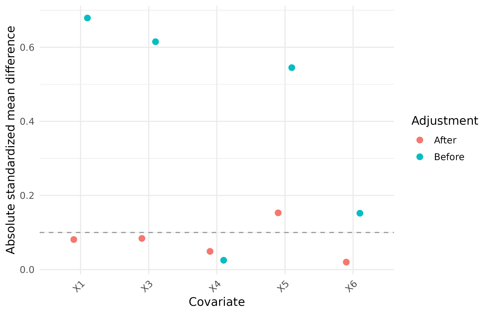
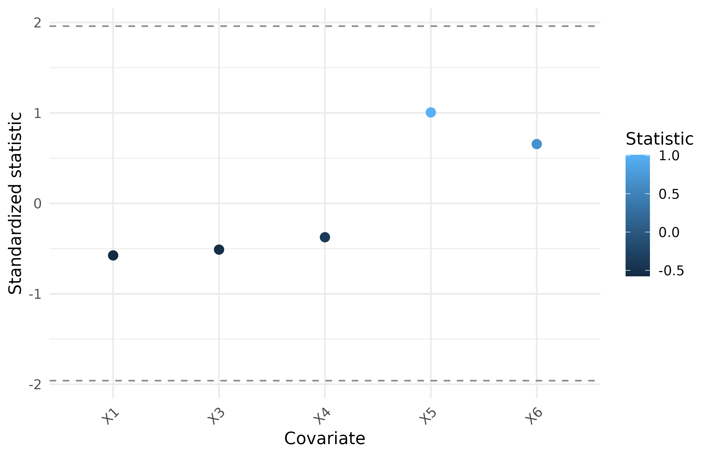
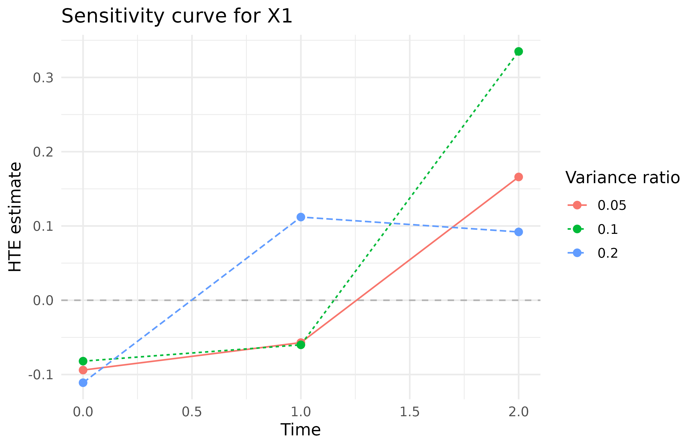
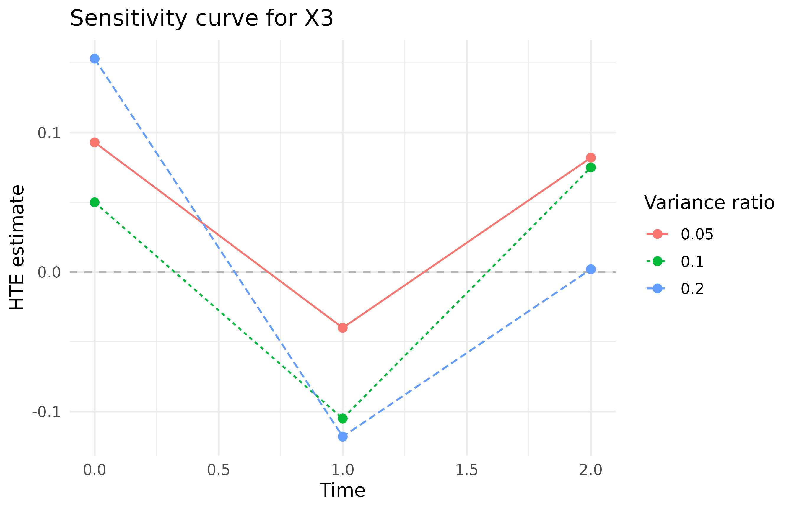
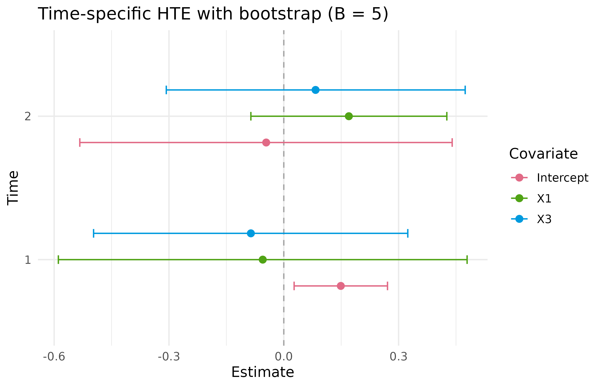
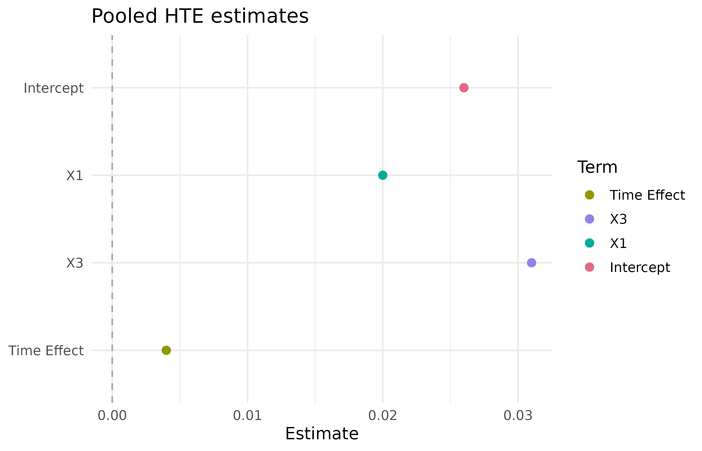

# Detailed Function Presentation

## PDRobust

This is a replicating process for script.

``` text
data("BiSample") -> Mapping() -> DataCheck() -> DataStandard() -> prediction / diagnostic / analysis functions
```

### 1. Load the built-in package data

``` r

library(PDRobust)
data("BiSample", package = "PDRobust")
head(BiSample)
#>   id time    Pi S1 S0 S A Y1 Y0 Y    X1     X2     X3 X4 X5 X6
#> 1  1    0 0.987  1  1 1 1  0  1 0 1.479 -0.168  0.873  0  1  1
#> 2  1    1 0.987  1  1 1 1  0  0 0 1.479 -0.168  0.873  0  1  1
#> 3  1    2 0.987  1  1 1 1  0  0 0 1.479 -0.168  0.873  0  1  1
#> 4  2    0 0.777  1  1 1 1  0  0 0 0.267  0.350 -1.438  1  1  1
#> 5  2    1 0.777  1  1 1 1  0  0 0 0.267  0.350 -1.438  1  1  1
#> 6  2    2 0.777  1  1 1 1  0  0 0 0.267  0.350 -1.438  1  1  1
```

### 2. Define roles and analysis settings with `Mapping()`

``` r

mapping <- Mapping(
  id = "id",
  time = "time",
  treatment = "A",
  survival = "S",
  outcome = "Y",
  baseline_time = 0,
  cutoff_time = 2,
  covariates = c("X1", "X3", "X4", "X5", "X6"),
  interest_vars = c("X1", "X3"),
  y_type = "B"
)

print(mapping)
#> PDRobust data mapping
#>   ID: id
#>   Time: time
#>   Treatment: A
#>   Survival: S
#>   Outcome: Y
#>   Baseline time: 0
#>   Cutoff time: 2
#>   Mapped covariates: X1, X3, X4, X5, X6
#>   Interest variables: X1, X3
#>   Outcome type: B (binary)
```

### 3. Validate the raw data with `DataCheck()`

``` r

check <- DataCheck(BiSample, mapping, strict = FALSE)
names(check)           
#> [1] "valid"                      "ready_for_analysis"        
#> [3] "manual_resolution_required" "can_standardize"           
#> [5] "checks"                     "settings"                  
#> [7] "diagnostics"
```

``` r

check$valid
#> [1] TRUE
check$ready_for_analysis
#> [1] TRUE
check$manual_resolution_required
#> [1] FALSE
check$can_standardize
#> [1] TRUE
```

Detailed check report and diagnostics can be retained by using
`check$diagnostics` and `check$check`, respectively.

### 4. Standardize the panel with `DataStandard()`

``` r

pd_data <- DataStandard(BiSample, mapping, drop =TRUE)
head(pd_data)
#>   id time    Pi S1 S0 S A Y1 Y0 Y    X1     X2     X3 X4 X5 X6
#> 1  1    0 0.987  1  1 1 1  0  1 0 1.479 -0.168  0.873  0  1  1
#> 2  1    1 0.987  1  1 1 1  0  0 0 1.479 -0.168  0.873  0  1  1
#> 3  1    2 0.987  1  1 1 1  0  0 0 1.479 -0.168  0.873  0  1  1
#> 4  2    0 0.777  1  1 1 1  0  0 0 0.267  0.350 -1.438  1  1  1
#> 5  2    1 0.777  1  1 1 1  0  0 0 0.267  0.350 -1.438  1  1  1
#> 6  2    2 0.777  1  1 1 1  0  0 0 0.267  0.350 -1.438  1  1  1
```

#### Imperfect dataset

For imperfect dataset, we have:

``` r

data("ImperfectConSample", package = "PDRobust")
head(ImperfectConSample)
#>   patient_id visit_month alive_status treatment clinical_outcome     X1     X2
#> 1    PT-0171           0            1         1            4.598  1.452 -2.075
#> 2    PT-0100           6            0         1               NA  1.473 -0.758
#> 3    PT-0056           0            1         0            8.806 -2.722 -0.735
#> 4    PT-0034           6            1         0           13.851 -1.471  0.278
#> 5    PT-0164          12            1         1            9.643 -1.272 -1.881
#> 6    PT-0058           0            1         1           10.341 -0.534 -0.842
#>       X3 X4 X5 X6
#> 1 -0.147  0  1  1
#> 2  0.608  0  1  1
#> 3  0.424  1  1  0
#> 4 -0.158  0  0  0
#> 5 -3.333  0  1  0
#> 6 -0.092  0  1  0
```

``` r

con_mapping <- Mapping(
  id = "patient_id",
  time = "visit_month",
  treatment = "treatment",
  survival = "alive_status",
  outcome = "clinical_outcome",
  baseline_time = 0,
  cutoff_time = 12,
  covariates = c("X1", "X2", "X3", "X4", "X5", "X6"),
  interest_vars = c("X1", "X2"),
  y_type = "C"
)

con_data <- DataStandard(ImperfectConSample, con_mapping, drop = TRUE)
```

``` r

head(con_data)
#>   patient_id visit_month alive_status treatment clinical_outcome     X1     X2
#> 1          1           0            1         1           10.803  0.168  0.421
#> 2          1           1            1         1           12.006  0.168  0.421
#> 3          1           2            1         1            7.833  0.168  0.421
#> 4          2           0            1         0            4.101 -2.400 -0.324
#> 5          2           1            1         0            5.508 -2.400 -0.324
#> 6          2           2            0         0               NA -2.400 -0.324
#>       X3 X4 X5 X6
#> 1 -0.557  1  1  1
#> 2 -0.557  1  1  1
#> 3 -0.557  1  1  1
#> 4 -0.391  0  0  0
#> 5 -0.391  0  0  0
#> 6 -0.391  0  0  0
```

``` r

print(dim(ImperfectConSample))
#> [1] 599  11
print(dim(con_data))
#> [1] 588  11
```

### 5.1 Prediction functions and Diagnostics

``` r

ps_fo <- A ~ X1 + X3 + X4 + X5 + X6
prin_fo <- S ~ (X1 + X3 + X4 + X5 + X6 ) * A
out_fo <- Y ~ (X1 + X3 + X4 + X5 + X6) * A + S
```

#### Propensity score model

``` r

ps <- PSPred(
  ps_fo = ps_fo,
  fit_dat = pd_data,
  pred_dat = pd_data,
  mapping = mapping
)
           
head(ps)
#> [1] 0.987 0.987 0.987 0.873 0.873 0.873
```

``` r

ps_diagnostic <- PSDiag(data = pd_data,
                        ps_fo = ps_fo)

print(ps_diagnostic)
#> Exposure-model balance diagnostics
#>  covariate adjustment   smd
#>         X1     Before 0.679
#>         X3     Before 0.615
#>         X4     Before 0.025
#>         X5     Before 0.545
#>         X6     Before 0.152
#>         X1      After 0.081
#>         X3      After 0.084
#>         X4      After 0.049
#>         X5      After 0.153
#>         X6      After 0.020
ps_diagnostic$plot
```



#### Principal score model

``` r

p0 <- PrinPred(
  prin_fo = prin_fo,
  fit_dat = pd_data,
  pred_dat = pd_data,
  a = 0,
  mapping = mapping
)

head(p0)
#> [1] 1.000 0.985 0.971 1.000 0.990 0.979
```

``` r

principal_diagnostic <- PrinSDiag(
  data = pd_data, 
  ps_fo = ps_fo, 
  prin_fo = prin_fo)

print(principal_diagnostic)
#> Principal-score diagnostics
#>  covariate statistic
#>         X1    -0.575
#>         X3    -0.511
#>         X4    -0.374
#>         X5     1.006
#>         X6     0.656
principal_diagnostic$plot
```



#### Outcome model

``` r

mu1 <- OutPred(
  out_fo = out_fo,
  fit_dat = pd_data,
  pred_dat = pd_data,
  a = 1,
  mapping = mapping
)

head(mu1)
#> [1] 0.228 0.228 0.228 0.255 0.255 0.255
```

``` r

set.seed(12345)
sensitivity <- SA(
  data  = pd_data,
  ps_fo = ps_fo,
  prin_fo = prin_fo,
  out_fo = out_fo,
  ratiovec = c(0.05,0.1, 0.2)
)
print(sensitivity)
#> Sensitivity analysis
#>  ratiovec time Intercept     X1     X3
#>      0.05    0    -0.045 -0.094  0.093
#>      0.10    0    -0.098 -0.082  0.050
#>      0.20    0    -0.015 -0.111  0.153
#>      0.05    1     0.139 -0.057 -0.040
#>      0.10    1     0.235 -0.060 -0.105
#>      0.20    1     0.244  0.112 -0.118
#>   Scenarios: 3
sensitivity$plot
#> $X1
```



    #> 
    #> $X3



#### Principal-stratum profiling with `QR()`

``` r

principal_profile <- QR(
  data = pd_data,
  prin_fo = prin_fo,
  quantile_level = c(0.25, 0.50, 0.75)
)

print(principal_profile)
#> Principal-stratum weighted means
#>     X1     X3 
#>  0.117 -0.136 
#> 
#> Weighted quantiles (NA for binary variables)
#> $X1
#>  q0.25  q0.50  q0.75 
#> -0.517  0.130  0.728 
#> 
#> $X3
#>  q0.25  q0.50  q0.75 
#> -0.766 -0.168  0.514
principal_profile$plot
#> NULL
```

#### Treatment-group odds ratios

``` r

or_control <- ORCI(
  data = pd_data,
  fomula = S ~ X1 + X3 + X4,
  a = 0,
  conf_level = 0.95
)

print(or_control)             
#> Odds ratios and confidence intervals
#>  covname estcoef lowerbd upperbd
#>       X1   2.044   1.111   3.761
#>       X3   0.565   0.301   1.059
#>       X4   2.213   0.748   6.549
or_control$plot
```


### 5.2 Heterogeneous treatment effect

``` r

set.seed(12345)
separate_hte <- HTESepT(
  data = pd_data,
  ps_fo = ps_fo,
  prin_fo = prin_fo,
  out_fo = out_fo,
  target_time = c(1, 2),
  B = 5,
  conf_level = 0.95,
  max_attempts = NULL,
  verbose = TRUE
)

separate_hte$summary
#>   time covariate estimate    SD LowerBound UpperBound
#> 1    1 Intercept    0.149 0.062      0.027      0.271
#> 2    1        X1   -0.055 0.272     -0.589      0.479
#> 3    1        X3   -0.086 0.209     -0.497      0.324
#> 4    2 Intercept   -0.046 0.248     -0.533      0.440
#> 5    2        X1    0.170 0.131     -0.086      0.426
#> 6    2        X3    0.083 0.199     -0.307      0.474
separate_hte$forest_plot
```



``` r

head(separate_hte$boot_mat)
#>       1_Intercept       1_X1        1_X3 2_Intercept        2_X1       2_X3
#> boot1  0.15753353  0.2290715 -0.13673408 -0.24449491  0.11106612 -0.1794279
#> boot2  0.24092663 -0.1103065  0.37406426 -0.41292665 -0.00301342 -0.1142041
#> boot3  0.22982461  0.1537350  0.23565340 -0.49775542 -0.03054196 -0.1849731
#> boot4  0.13987791 -0.4202748 -0.05162735 -0.06794426  0.11749858  0.2599216
#> boot5  0.09411466  0.1793230  0.04375399  0.10963763  0.30037793  0.1173508
```

``` r

pooled_hte <- HTEAllT(
  data = pd_data,
  ps_fo = ps_fo,
  prin_fo = prin_fo,
  out_fo = out_fo,
  B = 0,
  verbose = FALSE
)
pooled_hte$summary
#>          term estimate SD LowerBound UpperBound
#> 1   Intercept    0.026 NA         NA         NA
#> 2          X1    0.020 NA         NA         NA
#> 3          X3    0.031 NA         NA         NA
#> 4 Time Effect    0.004 NA         NA         NA
pooled_hte$forest_plot
```


