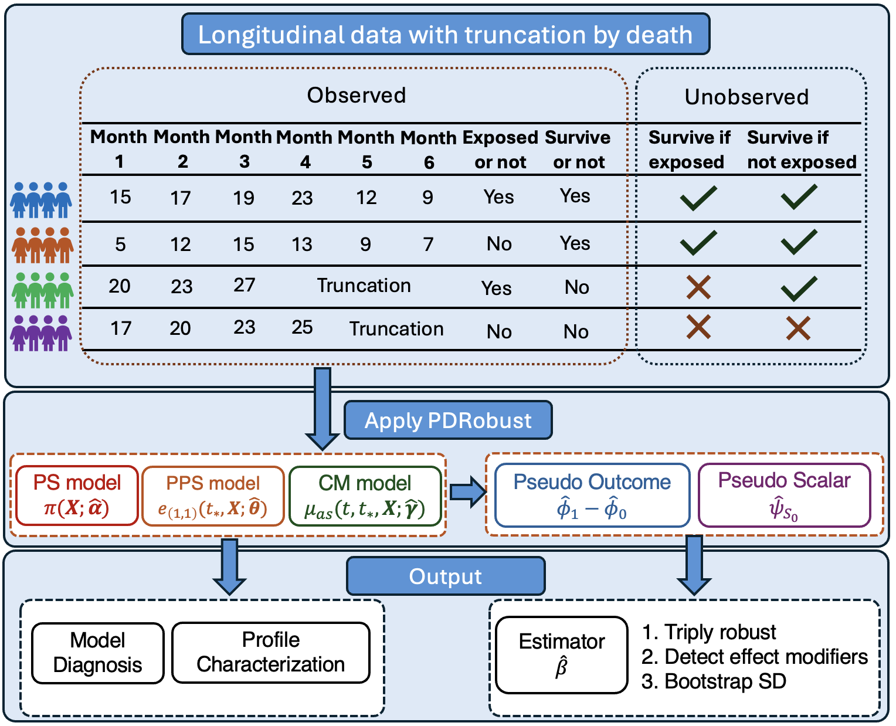

<div id="main" class="col-md-9" role="main">

# PDRobust: Longitudinal treatment effects under truncation by death

<div class="section level1">

<div class="figure">



PDRobust analysis workflow

</div>

<div class="section level2">

## Background

Real-world data, such as administrative claims and/or electronic health
records, is widely used for conducting longitudinal trajectory analyses.
However, when investigating the trajectory of the Heterogeneous
Treatment Effect (HTE) of an exposure/intervention, traditional methods
cannot sufficiently address challenges inherent to the data, including

1.  the presence of truncation by death, and

2.  the characterization of the unobserved principal stratum of patients
    who would survive till the specific time point regardless of the
    exposure occurrence.

Therefore, methodological innovation is required to deal with these two
challenges to obtain valid inference and interpretability.

</div>

<div class="section level2">

## Introduction

**PDRobust** is a novel analytical tool that incorporates multiple
statistical techniques, including propensity score weighting, principal
score weighting, conditional outcome mean fitting, and projection
methods. It provides a thorough set of analyses, including the triply
robust estimate of the HTE with the bootstrap standard deviation, and
the diagnosis of nuisance models. The workflow implemented in `PDRobust`
is outlined below, followed by an illustrative example demonstrating its
application.

The methodological reference is Zhang et al. (2026), [A Novel Tool for
Evaluating Effect Modification in Older Adults with ADRD Using Medicare
Claims](https://doi.org/10.48550/arXiv.2608.06654). Use
`citation("PDRobust")` for the software and paper citations.

**Treatment coding matters.** This release retains the 0.3.7 convention:
treatment `1` is the survival-favorable arm. The paper’s main estimator
uses the opposite labels. Recode paper-coded treatment as `1 - A` before
mapping and standardizing, then negate estimates and swap/negate
confidence limits to report the paper’s contrast. The bundled examples
already use the package convention. Read
`vignette("method-and-coding", package = "PDRobust")` before adapting
the workflow to a study. Data checks cannot verify the causal
identifying assumptions, and `SA()` provides outcome-noise sensitivity
rather than the paper’s principal-ignorability sensitivity analysis.

``` text
data -> Mapping() -> DataCheck() -> DataStandard()
     -> prediction / diagnostic / analysis functions
```

<div class="section level3">

### 1. Load the built-in package data

`ImperfectConSample` is a built-in example with deliberately imperfect
records and continuous outcome for demonstrating validation and explicit
subject-level deletion.

<div id="cb2" class="sourceCode">

``` r
library(PDRobust)
data("ImperfectConSample", package = "PDRobust")
dim(ImperfectConSample)
#> [1] 599  11
```

</div>

<div id="cb3" class="sourceCode">

``` r
head(ImperfectConSample)
#>   patient_id visit_month alive_status treatment clinical_outcome     X1     X2
#> 1    PT-0171           0            1         1            4.598  1.452 -2.075
#> 2    PT-0100           6            0         1               NA  1.473 -0.758
#> 3    PT-0056           0            1         0            8.806 -2.722 -0.735
#> 4    PT-0034           6            1         0           13.851 -1.471  0.278
#> 5    PT-0164          12            1         1            9.643 -1.272 -1.881
#> 6    PT-0058           0            1         1           10.341 -0.534 -0.842
#>       X3 X4 X5 X6
#> 1 -0.147  0  1  1
#> 2  0.608  0  1  1
#> 3  0.424  1  1  0
#> 4 -0.158  0  0  0
#> 5 -3.333  0  1  0
#> 6 -0.092  0  1  0
```

</div>

</div>

<div class="section level3">

### 2. Define roles and analysis settings with `Mapping()`

`Mapping()` is the sole source of truth for structural column names, raw
baseline and cutoff times, all nuisance-model covariates, effect
modifiers, and the outcome type.

<div id="cb4" class="sourceCode">

``` r
mapping <- Mapping(
  id = "patient_id",
  time = "visit_month",
  treatment = "treatment",
  survival = "alive_status",
  outcome = "clinical_outcome",
  baseline_time = 0,
  cutoff_time = 12,
  covariates = c("X1", "X2", "X3", "X4", "X5", "X6"),
  interest_vars = c("X1", "X2"),
  y_type = "C"
)
```

</div>

</div>

<div class="section level3">

### 3. Validate the raw data with `DataCheck()`

`DataCheck()` never modifies the input data. It returns an itemized
validation report that includes the pass/fail status, severity,
analysis-blocking status, diagnostic details, and recommended handling
for each identified issue. Besides, it also returns dataset-level
indicators: whether the dataset is ready for analysis, whether it can be
processed by `DataStandard()` and whether it requires manual resolution.

<div id="cb5" class="sourceCode">

``` r
check <- DataCheck(ImperfectConSample, mapping)
```

</div>

<div id="cb6" class="sourceCode">

``` r
names(check)
#> [1] "valid"                      "ready_for_analysis"        
#> [3] "manual_resolution_required" "can_standardize"           
#> [5] "checks"                     "settings"                  
#> [7] "diagnostics"
```

</div>

<div id="cb7" class="sourceCode">

``` r
check$ready_for_analysis
#> [1] FALSE
check$manual_resolution_required
#> [1] FALSE
check$can_standardize
#> [1] TRUE
```

</div>

</div>

<div class="section level3">

### 4. Standardize the panel with `DataStandard()`

`DataStandard()` returns a sorted data frame. It safely converts
explicit binary encodings, maps subject identifiers and analysis-time to
consecutive integers, and attaches mapping and audit attributes. The
argument `drop` defaults to `FALSE`. Use `drop = TRUE` only when the
reported subject-level exclusions are intended.

<div id="cb8" class="sourceCode">

``` r
pd_data <- DataStandard(ImperfectConSample, mapping, drop = TRUE)
```

</div>

<div id="cb9" class="sourceCode">

``` r
head(pd_data)
#>   patient_id visit_month alive_status treatment clinical_outcome     X1     X2
#> 1          1           0            1         1           10.803  0.168  0.421
#> 2          1           1            1         1           12.006  0.168  0.421
#> 3          1           2            1         1            7.833  0.168  0.421
#> 4          2           0            1         0            4.101 -2.400 -0.324
#> 5          2           1            1         0            5.508 -2.400 -0.324
#> 6          2           2            0         0               NA -2.400 -0.324
#>       X3 X4 X5 X6
#> 1 -0.557  1  1  1
#> 2 -0.557  1  1  1
#> 3 -0.557  1  1  1
#> 4 -0.391  0  0  0
#> 5 -0.391  0  0  0
#> 6 -0.391  0  0  0
```

</div>

</div>

<div class="section level3">

### 5. Run analysis and diagnostic functions

Specify the nuisance models before analysis. Here, `ps_fo` denotes the
propensity-score model, `prin_fo` the principal-score model, and
`out_fo` the outcome model.

<div id="cb10" class="sourceCode">

``` r
ps_fo <- treatment ~ X1 + X2 + X3 + X4 + X5 + X6
prin_fo <- alive_status ~ X1 + X2 + X3 + X4 + X5 + X6 
out_fo <- clinical_outcome ~ (X1 + X2 + X3 + X4 + X5 + X6) * treatment 
```

</div>

`HTESepT()` estimates time-specific heterogeneous treatment effects. For
each time in `target_time`, it returns the intercept and coefficients of
the mapped effect modifiers, together with a forest plot.

The argument `target_time` controls only the outcome-analysis time
points reported in the results. Setting `B > 0` enables subject-level
bootstrap estimation of standard errors and confidence intervals. When
`B = 0`, the function will only return the point estimates. The three
bootstrap replications below keep this demonstration fast; they are
insufficient for substantive standard errors or confidence intervals.
For an analysis, increase `B` and assess the stability of the inference.
Setting a seed makes the example reproducible with the same R and
dependency versions.

<div id="cb11" class="sourceCode">

``` r
set.seed(20260912)
separate_hte <- HTESepT(
  pd_data,
  ps_fo = ps_fo,
  prin_fo = prin_fo,
  out_fo = out_fo,
  target_time = c(1, 2),
  B = 3,
  verbose = TRUE
)
```

</div>

<div id="cb12" class="sourceCode">

``` r
separate_hte$summary
#>   time covariate estimate    SD LowerBound UpperBound
#> 1    1 Intercept    3.300 1.320      0.713      5.888
#> 2    1        X1    0.371 1.918     -3.388      4.130
#> 3    1        X2   -1.274 2.119     -5.428      2.880
#> 4    2 Intercept    0.835 0.745     -0.626      2.296
#> 5    2        X1   -0.094 0.859     -1.778      1.591
#> 6    2        X2    0.106 1.708     -3.241      3.453
```

</div>

<div id="cb13" class="sourceCode">

``` r
separate_hte$forest_plot
```

</div>


The following table summarizes the objectives and arguments of all
functions provided by the package.

| Function and arguments                                                                                           | Objectives and returned results                                                                                                                                                |
|:-----------------------------------------------------------------------------------------------------------------|:-------------------------------------------------------------------------------------------------------------------------------------------------------------------------------|
| `Mapping(id, time, treatment, survival, outcome, baseline_time, cutoff_time, covariates, interest_vars, y_type)` | Defines the structural roles of variables, analysis times, covariates, effect modifiers, and outcome type.                                                                     |
| `DataCheck(data, mapping, strict = FALSE)`                                                                       | Evaluates data readiness and returns dataset-level validation flags, itemized checks, diagnostic details, and recommended handling.                                            |
| `DataStandard(data, mapping, drop = FALSE)`                                                                      | Returns a standardized and sorted longitudinal data frame with attached mapping and audit attributes.                                                                          |
| `PSPred(ps_fo, fit_dat, pred_dat, mapping, ...)`                                                                 | Returns row-aligned propensity score predictions.                                                                                                                              |
| `PrinPred(prin_fo, fit_dat, pred_dat, a, mapping, ...)`                                                          | Returns row-aligned cumulative principal score predictions under treatment level `a`.                                                                                          |
| `OutPred(out_fo, fit_dat, pred_dat, a, mapping, ...)`                                                            | Returns row-aligned potential-outcome predictions under treatment level `a`.                                                                                                   |
| `PSDiag(data, ps_fo)`                                                                                            | Computes standardized mean differences for covariate-balance assessment of the fitted propensity score model; Returns the numeric results and corresponding diagnostic plot.   |
| `PrinSDiag(data, ps_fo, prin_fo)`                                                                                | Computes standardized test statistics for covariate-level assessment of the fitted principal score model; Returns the numeric results the corresponding diagnostic plot.       |
| `SA(data, ps_fo, prin_fo, out_fo, ratiovec = c(0, 0.05, 0.10))`                                                  | Perturbs outcomes with random noise and returns estimates and plots across noise levels.                                                                                       |
| `QR(data, prin_fo, quantile_level = 0.5)`                                                                        | Returns principal-score-weighted means and quantiles of mapped effect modifiers as numeric summaries and a tidy table.                                                         |
| `ORCI(data, fomula, a, conf_level = 0.95)`                                                                       | Returns model-based survival odds ratios at cutoff within treatment group `a`, confidence intervals, and a plot. The argument spelling `fomula` is retained for compatibility. |
| `HTESepT(data, ps_fo, prin_fo, out_fo, target_time, B, conf_level = 0.95, max_attempts = NULL, verbose = TRUE)`  | Returns time-specific heterogeneous treatment effect estimates, bootstrap results, and forest plots for the specified analysis times.                                          |
| `HTEAllT(data, ps_fo, prin_fo, out_fo, B, conf_level = 0.95, max_attempts = NULL, verbose = TRUE)`               | Returns pooled heterogeneous treatment effect estimates across analysis times, bootstrap results, and a forest plot.                                                           |

**More tutorials available on
[tutorials](https://whhuan.github.io/PD_Robust/).**

</div>

</div>

<div class="section level2">

## Installation

Install a locally downloaded source release with:

<div id="cb14" class="sourceCode">

``` r
install.packages("PDRobust_0.3.8.tar.gz", repos = NULL, type = "source")
```

</div>

The development version is available from GitHub:

<div id="cb15" class="sourceCode">

``` r
install.packages("remotes")
remotes::install_github("whhuan/PD_Robust")
```

</div>

</div>

</div>

</div>
